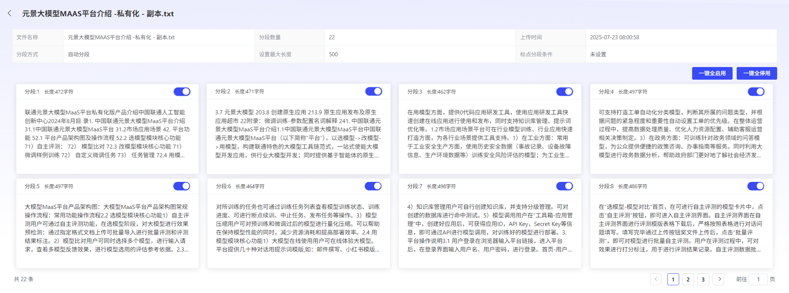

# 知识库

### **1、创建知识库**

若用户要使用RAG功能，需要先创建知识库，关联Embedding模型。其中Embedding模型，需提前在模型管理模块上传。用户也可进行标签设置，方便进行知识库筛选分类。（已创建但未填写内容的标签，可通过Backspace键快捷删除）

**创建知识库**：

1）文件上传：平台支持用户上传本地文件或者从url上传。

2）参数配置：平台支持自动分段与自定义分段2种模式。自定义分段，用户可设置分段时的标点符号、可分割最大值、可重叠值。若在模型广场中接入了ocr模型，解析方式还可勾选OCR，并选择对应模型。

**文档处理状态**：

 1）处理状态：上传完毕的文档可在文档列表中查看。文档内容的解析切分状态可在当前状态列中查看。当状态为“处理完成”，该文档知识即可在后续RAG使用知识库中生效。

2）查看分段结果：点击操作列的“查看”，即可查看状态为处理完成的文档分段结果。

在分段结果查看中，可以查看文档分段策略，及每一个分段的内容结果。可根据用户需求，点击每个分段卡片上的启停开关，对单独分段进行启动和停止。也可点击一键全启动或一键全停用，对整个文档的分段结果进行启动和停止。 

注：停止的分段内容在使用RAG能力时不会生效。 如需查看切段完整信息，点击分段卡片，可展示该分段的详情。

### **2、命中测试**

当用户需要测试知识库是否生效时，可使用“命中测试”功能快速测试。 点击“命中测试”按钮，进入命中测试界面。在“命中测试分段”中输入关键词并配置检索方式。如命中结果，即可获得相关命中得分，及分段内容，确认该知识分段已生效。

目前支持3种检索方式配置，用户可根据知识库内文档的内容特点及使用场景，调整检索策略：

1、向量检索：通过向量相似度找到语义相近、表达多样的文本片段，适用于理解和召回语义相关信息。

2、全文检索基于关键词匹配，能够高效查询包含指定词汇的文本片段，适用于精确查找。

3、混合检索：结合向量和关键词检索，融合语义理解与关键词匹配，兼顾相关性和准确性，提升检索效果。

### **3、关键词管理**

在知识库问答场景，可配置问题中使用的口语化关键词与知识库文档中词语的映射规则，便于提升知识库内容的召回效果及回答准确率 。

点击“创建关键词”，选择关联知识库，可将口语化表述与文中词语进行映射。

