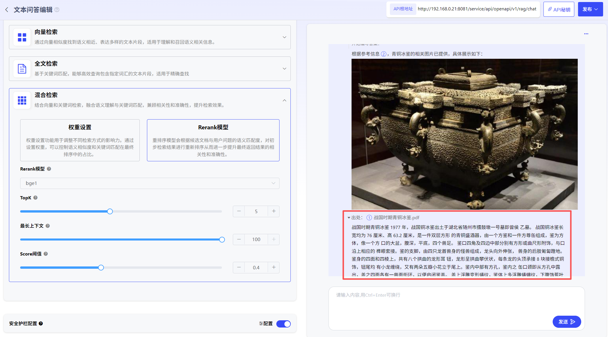
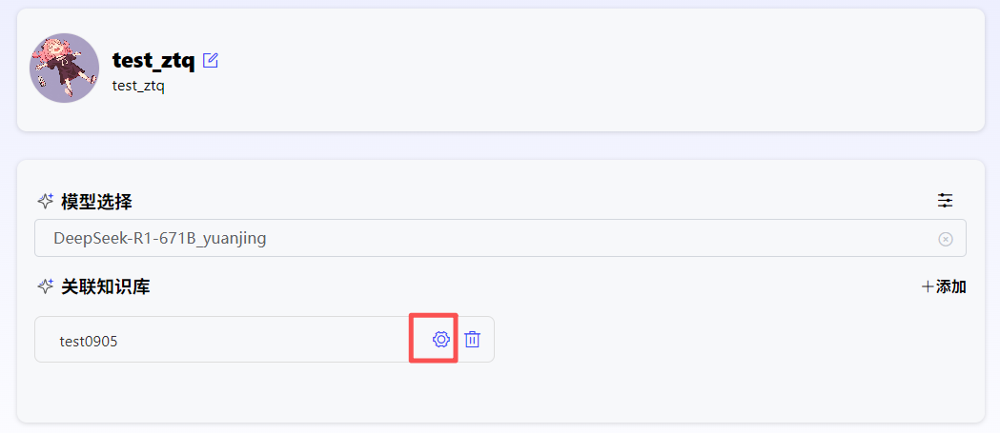

# 文本问答

### 1、文本问答创建

点击“创建文本问答”即可创建文本问答应用。用户可自行设定文本问答图标、名称、描述。

### 2、文本问答编辑

可通过选择大模型、知识库、配置检索方式，进行文本问答。问答将局限于知识库内，并给出相应出处。

- **检索方式配置：**

目前支持3种检索方式配置，用户可根据知识库内文档的内容特点及使用场景，调整检索策略：

1、向量检索：通过向量相似度找到语义相近、表达多样的文本片段，适用于理解和召回语义相关信息。

2、全文检索基于关键词匹配，能够高效查询包含指定词汇的文本片段，适用于精确查找。

3、混合检索：结合向量和关键词检索，融合语义理解与关键词匹配，兼顾相关性和准确性，提升检索效果。

- **元数据过滤-使用元数据筛选精准定位文档：**

在文本问答中，**元数据过滤**功能，能让你像使用高级搜索一样，根据文档的“标签”（如 `category`、`status`、`author` 等）精确过滤，从而大幅提升检索结果的相关性和准确性。

**1、选择筛选模式**

首先，你需要从以下2种模式中选择一种来定义筛选规则。

- **禁用模式**

  *   **说明**：这是默认选项。选择此模式将完全关闭元数据筛选功能，节点会检索所有选中的知识库，不考虑任何元数据。

  *   **适用场景**：当你需要全面检索，或知识库文档没有统一的元数据标准时。

- **手动模式**

  *   **说明**：完全由你自定义筛选规则，自由组合多个条件，实现最精细的控制。
  *   **适用场景**：处理复杂的、多条件的、逻辑固定的筛选需求。这是最常用也最强大的模式。

**2、手动模式配置详解**

如果你选择了**手动模式**，请按照以下步骤进行配置：

**第1步：添加筛选条件**

1）在选择知识库后，点击**设置**按钮，打开元数据过滤按钮。

2）在配置框内，点击 **+新增条件**。

3）在弹出的下拉列表中，选择一个元数据字段。

*   **提示**：该列表会显示你当前选中的**知识库的所有**元数据字段。
*   如需添加更多字段，重复点击 **+新增条件** 即可。

**第2步：配置筛选规则**

选择字段后，你需要根据该字段的**数据类型**（字符串、数字、时间），来设定具体的筛选规则。

##### **A. 字符串类型**

适用于文本字段，如 `标签`、`分类`、`状态` 等。

| 筛选条件   | 说明与示例                                                   |
| :--------- | :----------------------------------------------------------- |
| **是**     | 完全匹配。例如 `is "Published"`，只返回状态**恰好是**“Published”的文档。 |
| **不是**   | 排除匹配。例如 `is not "Draft"`，返回所有状态**不是**“Draft”的文档。 |
| **为空**   | 字段为空。返回**未填写**该字段的文档。                       |
| **不为空** | 字段不为空。返回**已填写**该字段的文档。                     |
| **包含**   | 包含文本。例如 `contains "Report"`，会返回“Monthly Report”、“Annual Report”等。 |
| **不包含** | 不包含文本。例如 `not contains "Secret"`，会返回所有不含“Secret”的文档。 |
| **开始是** | 以...开头。例如 `starts with "Doc"`，会返回“Doc1”、“Document”等。 |
| **结束是** | 以...结尾。例如 `ends with "2024"`，会返回“Report 2024”、“Summary 2024”等。 |

> **⚠️ 大小写敏感提醒**：字符串匹配是**大小写敏感**的。`contains "App"` 会匹配 “Apple”，但**不会**匹配 “apple” 或 “APPLE”。

##### **B. 数字类型**

适用于数值字段，如 `阅读量`、`版本号`、`评分` 等。

| 筛选条件     | 说明与示例                                              |
| :----------- | :------------------------------------------------------ |
| **等于**     | 等于。例如 `= 100`，返回标记为100的文档。               |
| **不等于**   | 不等于。例如 `≠ 5`，返回所有标记不为5的文档。           |
| **大于**     | 大于。例如 `> 100`，返回标记大于100的文档。             |
| **小于**     | 小于。例如 `< 50`，返回标记小于50的文档。               |
| **大于等于** | 大于或等于。例如 `≥ 20`，返回标记大于或等于20的文档。   |
| **小于等于** | 小于或等于。例如 `≤ 200`，返回标记小于或等于200的文档。 |
| **为空**     | 字段为空。返回**未设置**该数字字段的文档。              |
| **不为空**   | 字段不为空。返回**已设置**该数字字段的文档。            |

##### **C. 时间类型**

适用于日期字段，如 `发布日期`、`最后修改时间` 等。

| 筛选条件   | 说明与示例                                                   |
| :--------- | :----------------------------------------------------------- |
| **是**     | 日期完全匹配。例如 `is "2024-01-01"`，只返回该日期的文档。   |
| **早于**   | 早于指定日期。例如 `before "2024-01-01"`，返回2024年1月1日之前的所有文档。 |
| **晚于**   | 晚于指定日期。例如 `after "2024-01-01"`，返回2024年1月1日之后的所有文档。 |
| **为空**   | 字段为空。返回**未设置**该时间字段的文档。                   |
| **不为空** | 字段不为空。返回**已设置**该时间字段的文档。                 |

**第3步：设置筛选值**

定义好规则后，你需要为规则提供一个具体的**筛选值**。

*   **字符串/数字**：直接输入即可，如 `Published`、`100`。
*   **时间**：系统会提供一个**时间选择器**，让你直观地选择日期，而无需手动输入格式。

**第4步：定义条件间的逻辑关系**

当你添加了**多条**筛选条件时，需要设定它们之间的关系。

*   **且逻辑**
    *   **含义**：文档**必须同时满足**所有条件，才会被检索到。
    *   **示例**：`category is "报告" 且 status is "已发布"`，只会检索出“分类为报告”**并且**“状态为已发布”的文档。
*   **或逻辑**
    *   **含义**：文档**只需满足其中任意一个**条件，就会被检索到。
    *   **示例**：`author is "张三" 或 author is "李四"`，会检索出所有作者是“张三”**或者**“李四”的文档。

### 3、文本问答发布

编辑完毕的文本问答应用，点击“发布”可进行发布方式选择，用户可进行私密发布，也可进行公开发布。

私密发布：发布后仅对自己可见，可在“探索广场”-“私密发布的”查看。

公开发布：发布后可对全部用户进行共享，所有用户可在“探索广场”-“全部”查看。

已发布的文本问答也可取消发布后，重新进行编辑。

### 4、生成API

  平台已针对应用封装了API，可点击“API秘钥”生成应用的专属API-Key授权，供用户进行调用。

