# 模型导入教程

## 一、OpenAI-API-compatible

平台支持导入所有符合OpenAI协议的模型，包括通义千问、百度千帆、硅基流动等。下面以百度千帆为例：

### LLM

1、 配置 百度智能云千帆 API Key https://console.bce.baidu.com/iam/#/iam/apikey/list

登录百度智能云控制台--安全认证--[API Key](https://console.bce.baidu.com/iam/#/iam/apikey/list)，新建或复制已有密钥。


点击创建API Key，选择自定义权限-千帆ModelBuilder，或直接选择全部产品权限，点击确定。创建成功后，即可复制使用。

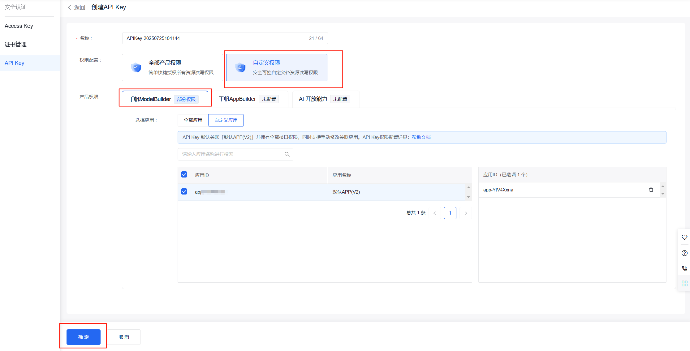


2、获取参数：选择想要导入的模型 https://console.bce.baidu.com/qianfan/modelcenter/model/buildIn/list

进入模型广场-选择模型-点击API文档


【模型名称】示例代码中的model，如ernie-3.5-8k

【API Key】第一步中申请的API Key

【推理url】复制调用接口：注意推理URL不带 /chat/completions 后缀，例如：https://qianfan.baidubce.com/v2


3、登录元景万悟，点击模型管理-模型导入-OpenAI-API-compatible-模型类型LLM，依次填写模型名称、API Key、推理url

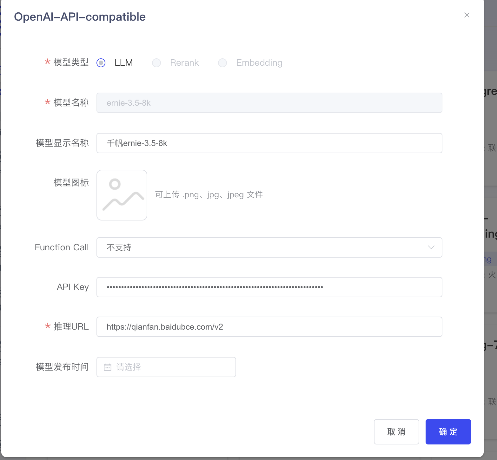


### Embedding

导入步骤同LLM，只需在模型广场中搜索Embedding模型即可


【模型名称】示例代码中的model，如embedding-v1

【API Key】第一步中申请的API Key

【推理url】复制调用接口：注意推理URL不带 /embeddings 后缀，例如：https://qianfan.baidubce.com/v2


3、登录元景万悟，点击模型管理-模型导入-OpenAI-API-compatible-模型类型Embedding，依次填写模型名称、API Key、推理url

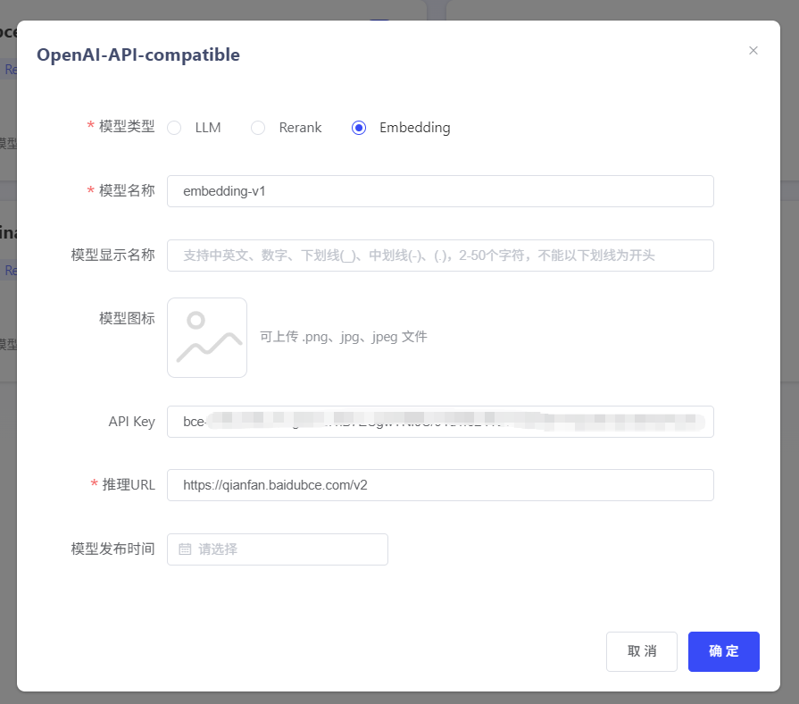


### Rerank

导入步骤同LLM，只需在模型广场中搜索Rerank模型即可

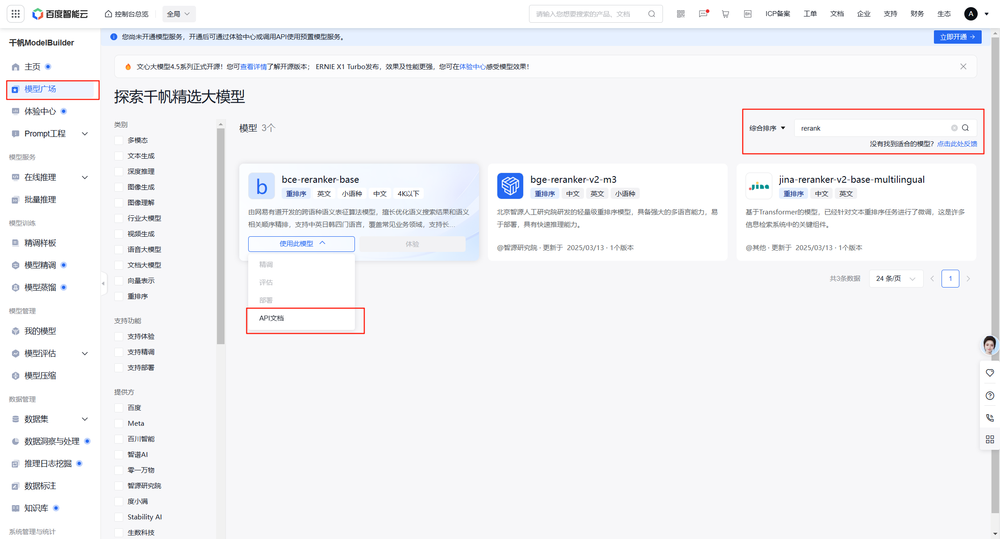

【模型名称】示例代码中的model，如bce-reranker-base

【API Key】第一步中申请的API Key

【推理url】复制调用接口：注意推理URL不带 /rerank 后缀，例如：https://qianfan.baidubce.com/v2

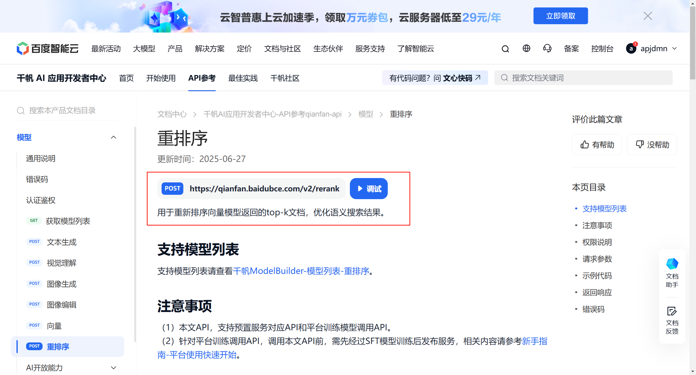


3、登录元景万悟，点击模型管理-模型导入-OpenAI-API-compatible-模型类型Rerank，依次填写模型名称、API Key、推理url

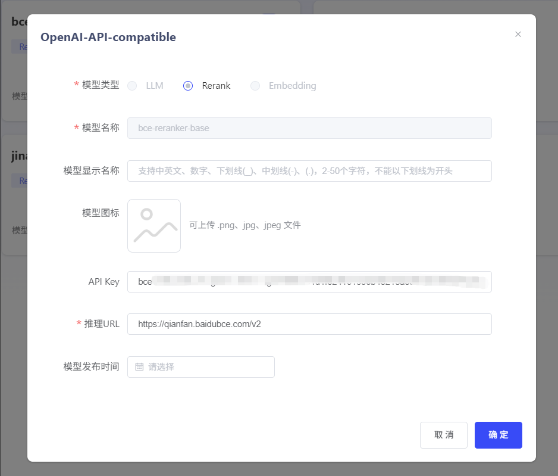


## 二、联通元景

### LLM

1、 配置 联通元景 API Key https://maas.ai-yuanjing.com/aibase/userCenter/appV2

登录元景MaaS平台--工具箱--API Key管理，新建或复制已有密钥。

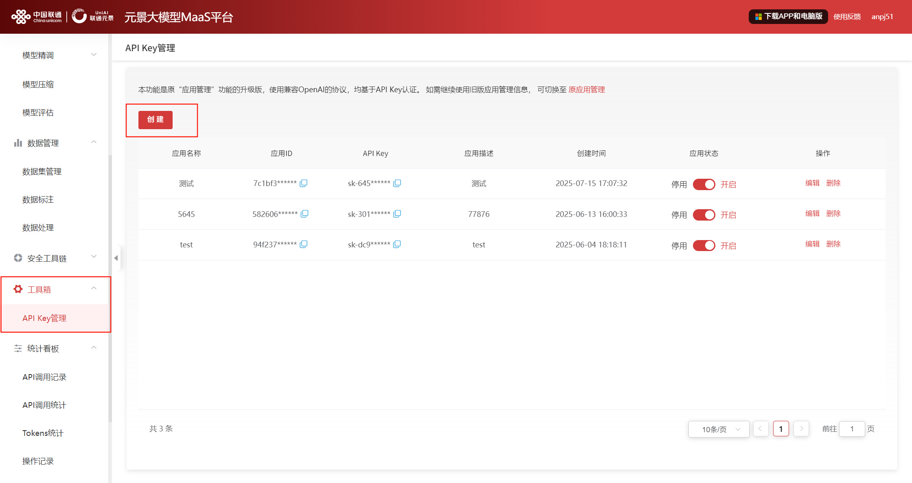

点击创建，填写应用名称及应用描述。确定后，即可生成API Key。

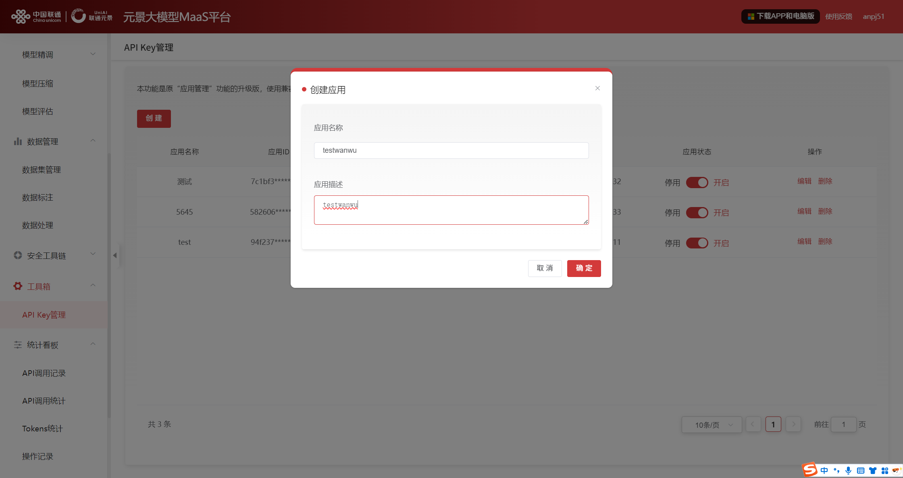


2、获取参数：选择想要导入的模型 https://maas.ai-yuanjing.com/aibase/portal/service

进入模型广场-选择模型-点击查看详情

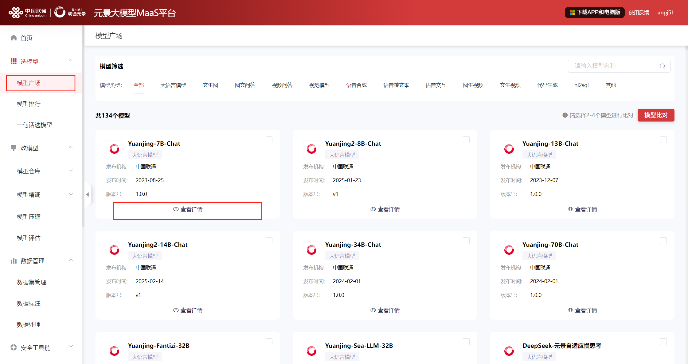

【模型名称】请求参数-model，如deepseek-r1-distill-qwen-32b

【API Key】第一步中申请的API Key

【推理url】请求接口-请求URL：注意推理URL不带 /chat/completions 后缀，例如：https://maas-api.ai-yuanjing.com/openapi/compatible-mode/v1

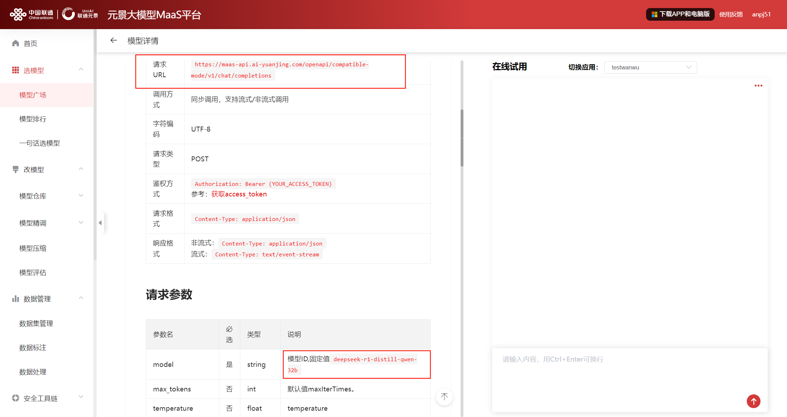

3、登录元景万悟，点击模型管理-模型导入-联通元景-模型类型LLM，依次填写模型名称、API Key、推理url

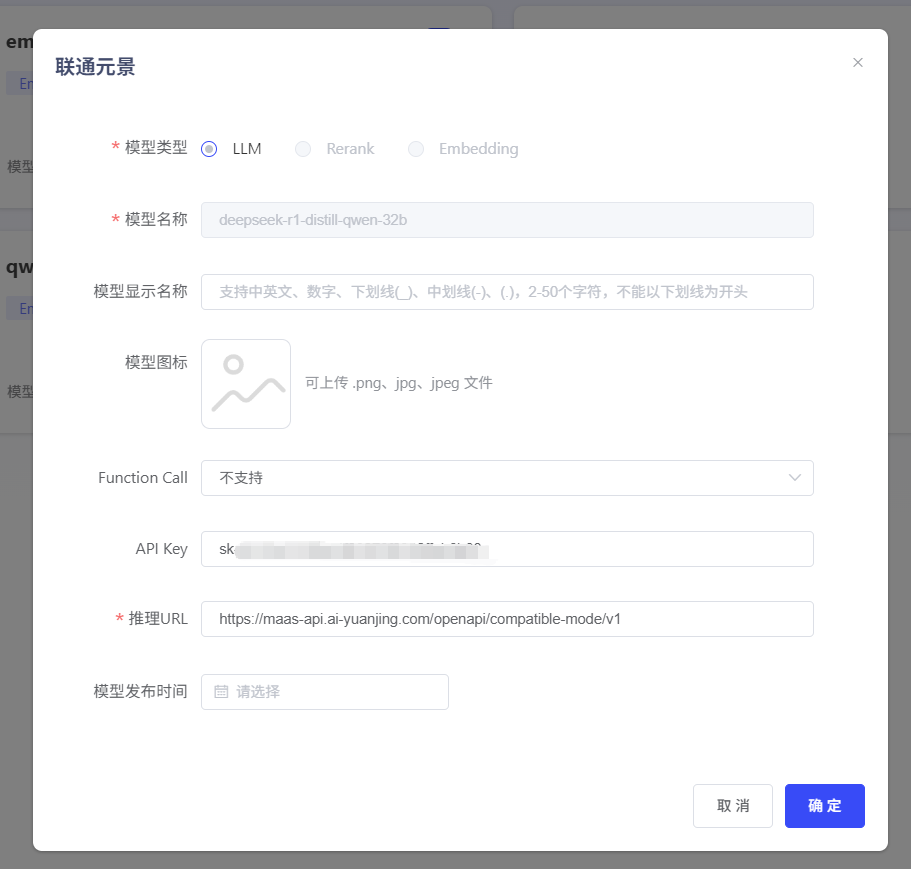


### Embedding

导入步骤同LLM，只需在文档中心中搜索Embedding模型即可 https://maas.ai-yuanjing.com/doc/pages/216556678/#%E8%AF%B7%E6%B1%82%E6%8E%A5%E5%8F%A3


【模型名称】请求示例中的model，如qwen3-embed-0.6b

【API Key】第一步中申请的API Key

【推理url】复制调用接口：注意推理URL不带 /embeddings 后缀，例如：https://maas-api.ai-yuanjing.com/openapi/compatible-mode/v1


登录元景万悟，点击模型管理-模型导入-联通元景-模型类型Embedding，依次填写模型名称、API Key、推理url


### Rerank

导入步骤同LLM，只需在文档中心中搜索rerank模型即可 https://maas.ai-yuanjing.com/doc/pages/216556678/#%E8%AF%B7%E6%B1%82%E6%8E%A5%E5%8F%A3


【模型名称】请求示例中的model，如bge-m3

【API Key】第一步中申请的API Key

【推理url】复制调用接口：注意推理URL不带 /rerank 后缀，例如：https://maas-api.ai-yuanjing.com/openapi/bge/v1


3、登录元景万悟，点击模型管理-模型导入-联通元景-模型类型rerank，依次填写模型名称、API Key、推理url

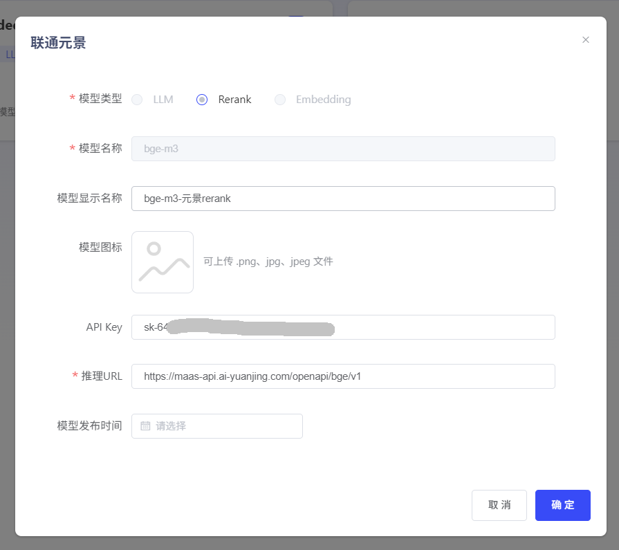

### OCR

【模型名称】固定为 yuanjingOcr

【API Key】第一步中申请的API Key

【推理url】复制调用接口，固定为 https://maas-api.ai-yuanjing.com/openapi/v1

登录元景万悟，点击模型管理-模型导入-联通元景-模型类型OCR，依次填写模型名称、API Key、推理url

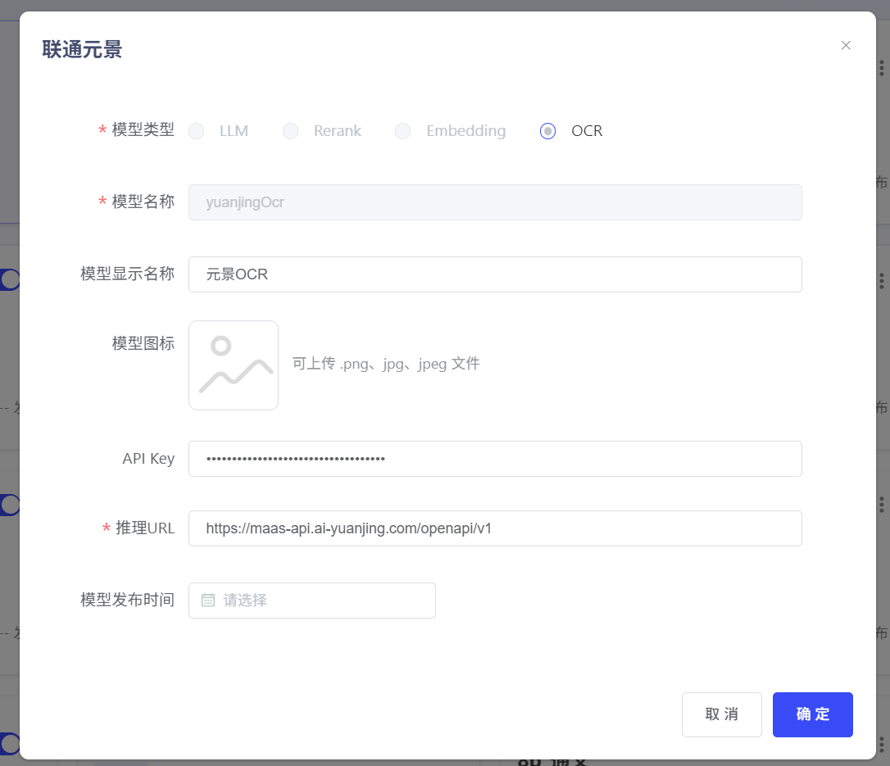

## 三、阿里通义千问

### LLM

1、 配置 阿里云百炼 API Key https://bailian.console.aliyun.com/?tab=model#/api-key

登录阿里云百炼平台--新用户开通。首次开通需实名制，具体步骤详见https://help.aliyun.com/zh/account/user-guide/individual-identities


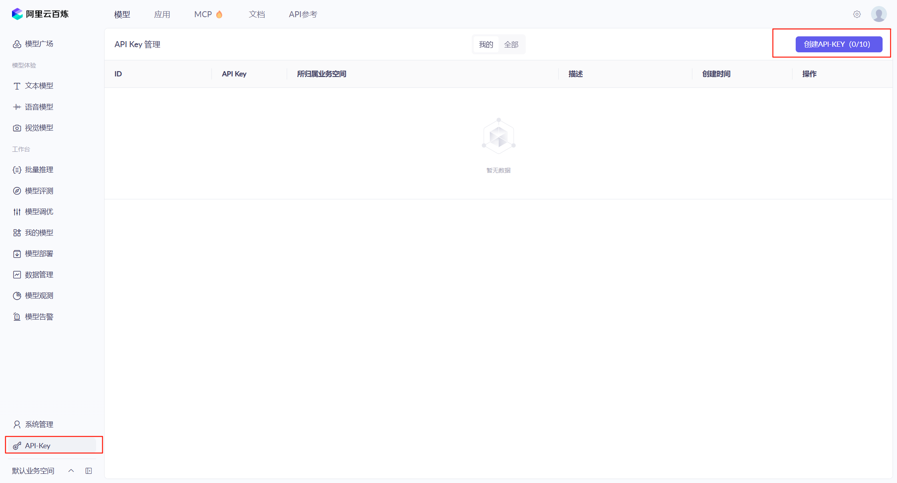

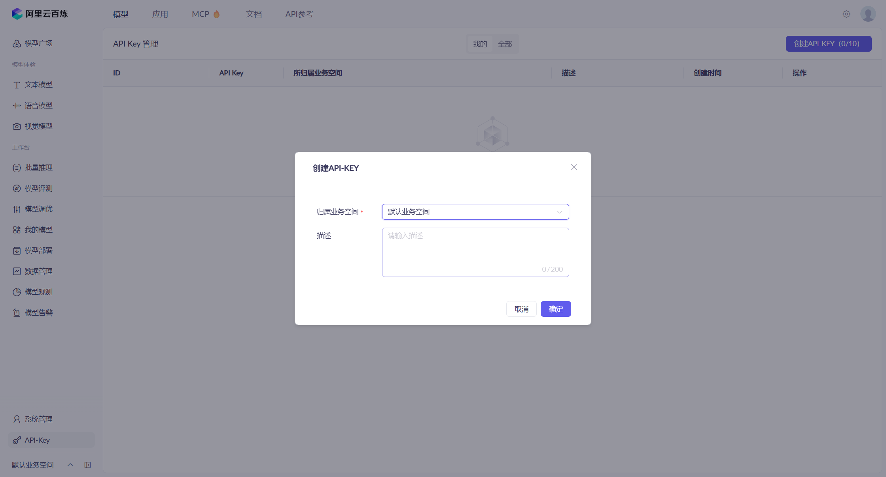


2、获取参数：选择想要导入的模型https://bailian.console.aliyun.com/?tab=model#/model-market

进入模型广场-选择模型-点击查看详情和API参考

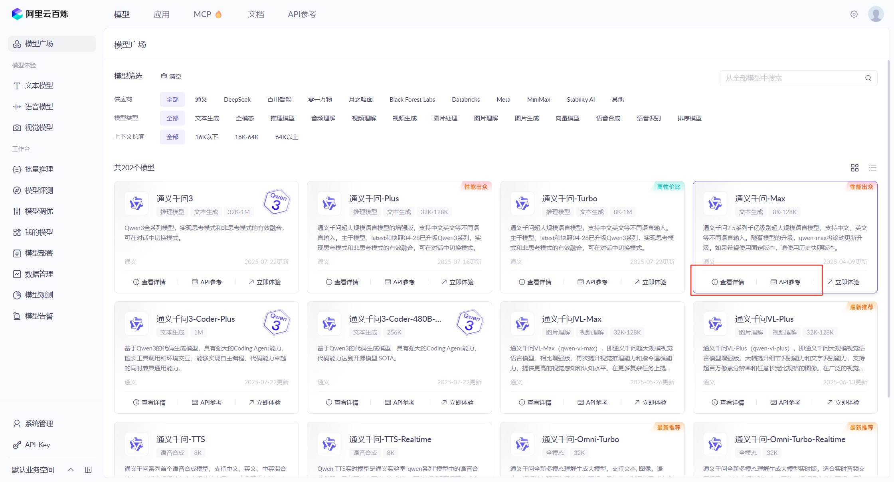

【模型名称】查看详情后的code，如qwen-max

【API Key】第一步中申请的API Key

【推理url】查看“API参考”，使用SDK调用：例如 https://dashscope.aliyuncs.com/compatible-mode/v1

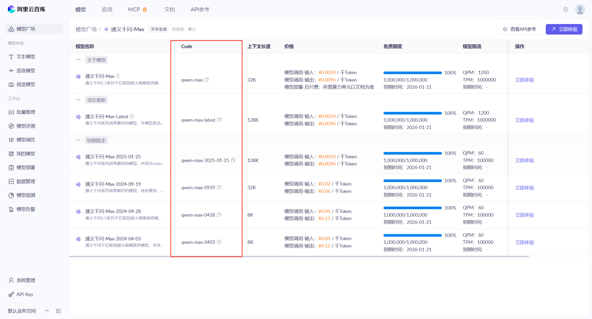

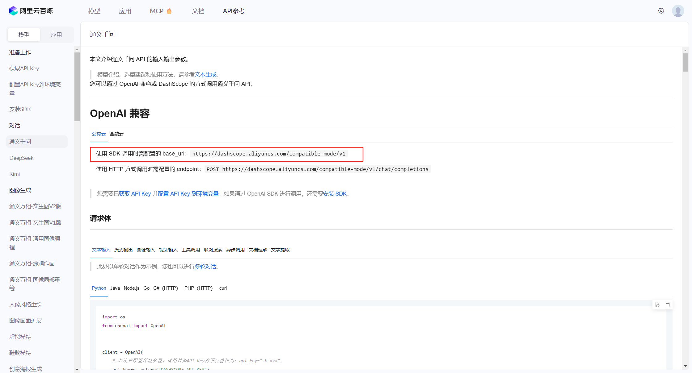

3、登录元景万悟，点击模型管理-模型导入-通义千问-模型类型LLM，依次填写模型名称、API Key、推理url


### Embedding

导入步骤同LLM，只需在模型广场中搜索Embedding模型即可 


【模型名称】查看“API参考”-模型名称，如text-embedding-v4

【API Key】第一步中申请的API Key

【推理url】查看“API参考”，快速入门中的示例代码base_url：例如 https://dashscope.aliyuncs.com/compatible-mode/v1


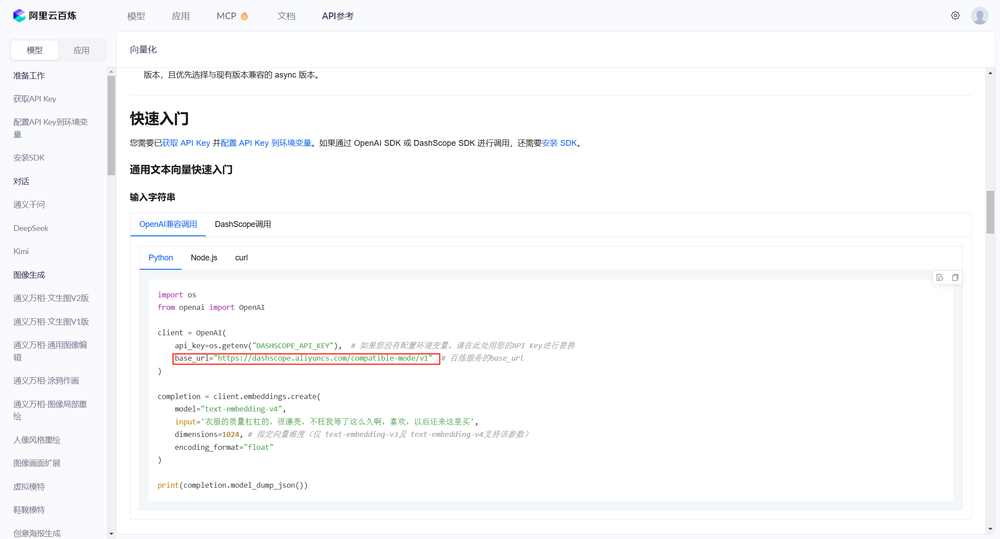

登录元景万悟，点击模型管理-模型导入-通义千问-模型类型Embedding，依次填写模型名称、API Key、推理url


### Rerank

导入步骤同LLM，只需在模型广场中搜索排序模型即可

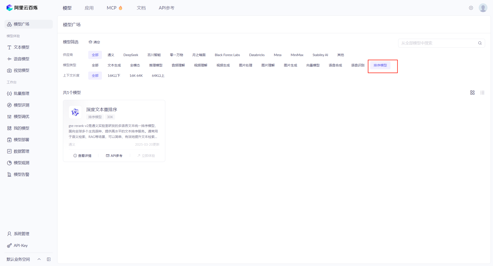

【模型名称】查看“API参考”-模型名称，，如gte-rerank-v2

【API Key】第一步中申请的API Key

【推理url】复制调用示例中的url：注意推理URL不带/services/rerank/text-rerank/text-rerank后缀，如：https://dashscope.aliyuncs.com/api/v1


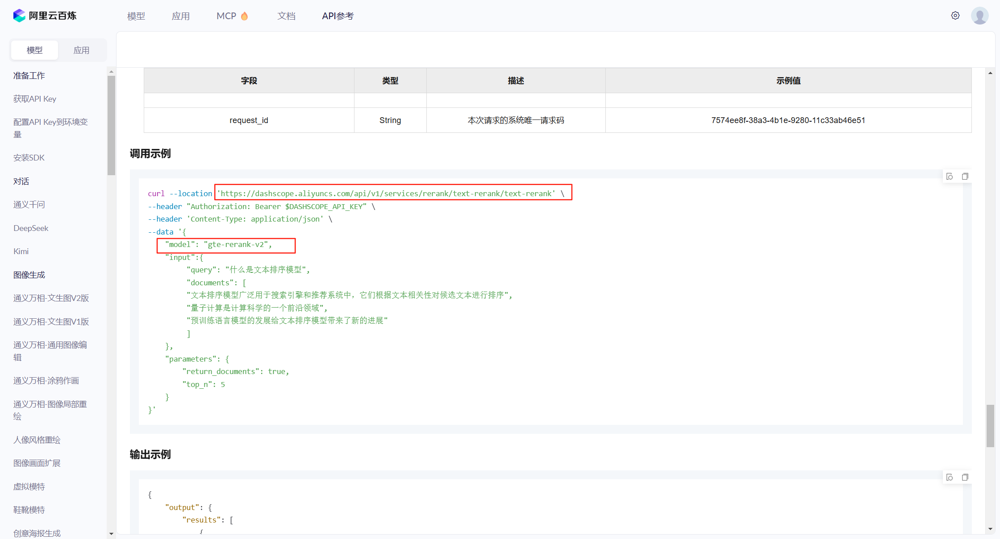

登录元景万悟，点击模型管理-模型导入-通义千问-模型类型Rerank，依次填写模型名称、API Key、推理url

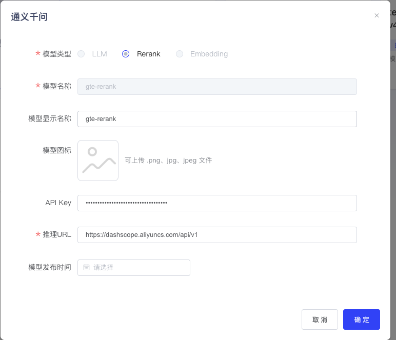

## 四、Ollama

### LLM

```
1. 本地Ollama部署：https://github.com/ollama/ollama

2. 用户在在本地启动Ollama服务，并确认服务正常启动，并确认模型已加载，并确认模型可正确请求，以请求qwen2.5:0.5b为例：
   curl --location 'http://本地ip:11434/v1/chat/completions' \
   --header 'Content-Type: application/json' \
   --header 'Accept: application/json' \
   --data '{
           "model": "qwen2.5:0.5b",
           "messages": [{
                   "role": "user",
                   "content": "你好"
           }]
   }'


3. 访问IP（注意localhost要换成本机局域网或对外IP，例如192.168.0.xx，不能是localhost或127.0.0.1）

4. 导入模型：
   4.1【模型名称】必须为上述curl中可以正确请求的model；例如 qwen2.5:0.5b
   4.2【访问IP】注意localhost要换成本机局域网或对外IP，例如192.168.0.xx，不能是localhost或127.0.0.1
   4.3【推理URL】必须为上述curl中可以正确请求的url；例如 http://本地ip:11434/v1（注意不带 /chat/completions 后缀）
```


### Embedding

导入Embedding模型同上述导入LLM，注意推理URL不带 /embeddings 后缀


## 五、火山引擎-豆包

### LLM

1、获取参数：选择想要导入的模型https://console.volcengine.com/ark/region:ark+cn-beijing/model?vendor=Bytedance&view=DEFAULT_VIEW

进入模型广场-选择模型-悬停


【模型名称】悬停后展示的Model ID，如doubao-seed-1-6-thinking-250715

【API Key】点击API接入，创建API Key

【推理url】获取API KEY后，点击“选择使用”，复制链接，注意推理URL不带/chat/completions后缀：例如 https://ark.cn-beijing.volces.com/api/v3


2、登录元景万悟，点击模型管理-模型导入-火山引擎-模型类型LLM，依次填写模型名称、API Key、推理url

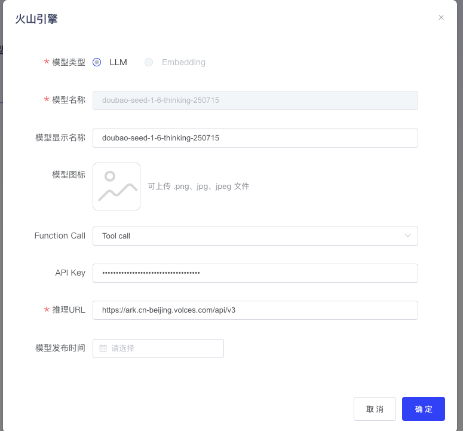

### Embedding

导入步骤同LLM，只需在模型广场中搜索向量模型即可

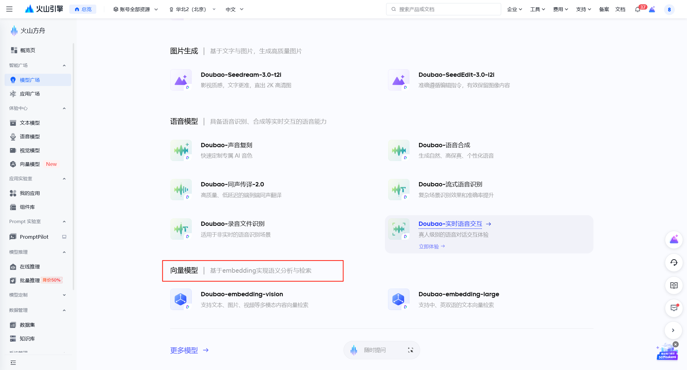

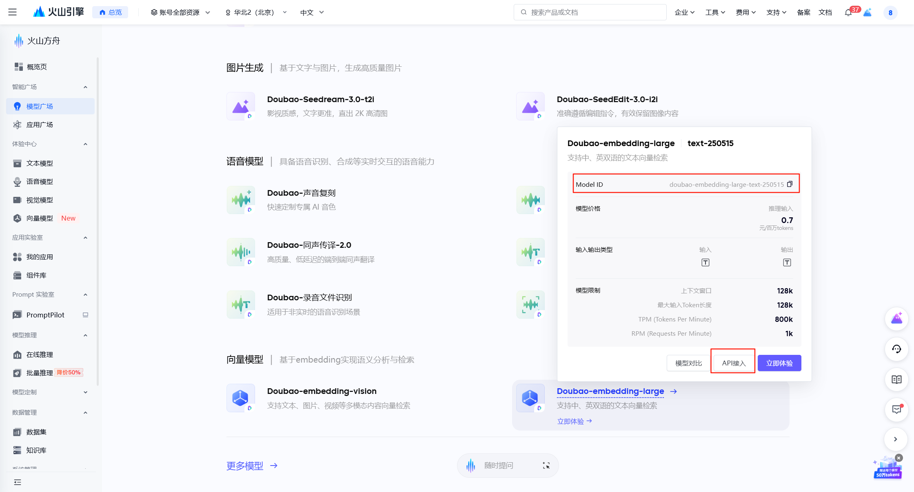

【模型名称】悬停后展示的Model ID，如doubao-embedding-large-text-250515

【API Key】点击API接入，创建API Key

【推理url】获取API KEY后，点击“选择使用”，复制base_url，注意推理URL不带/embeddings后缀：例如 https://ark.cn-beijing.volces.com/api/v3

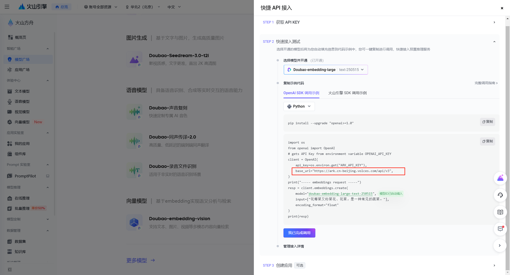

登录元景万悟，点击模型管理-模型导入-火山引擎-模型类型Embedding，依次填写模型名称、API Key、推理url

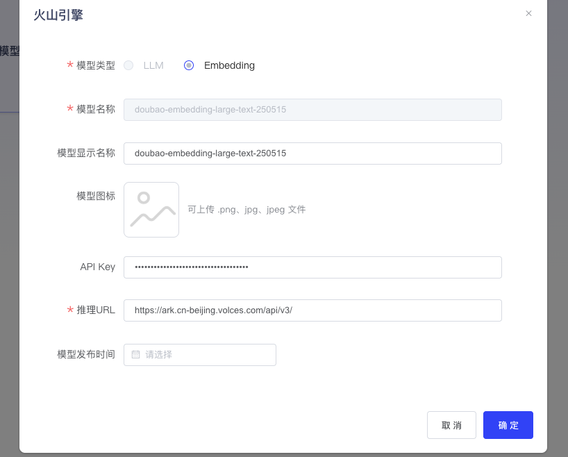

