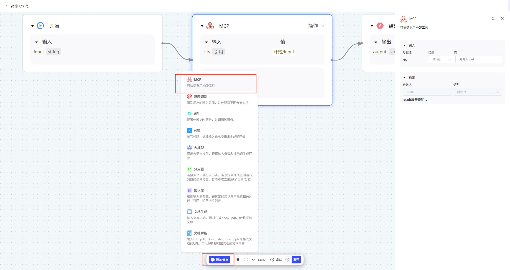
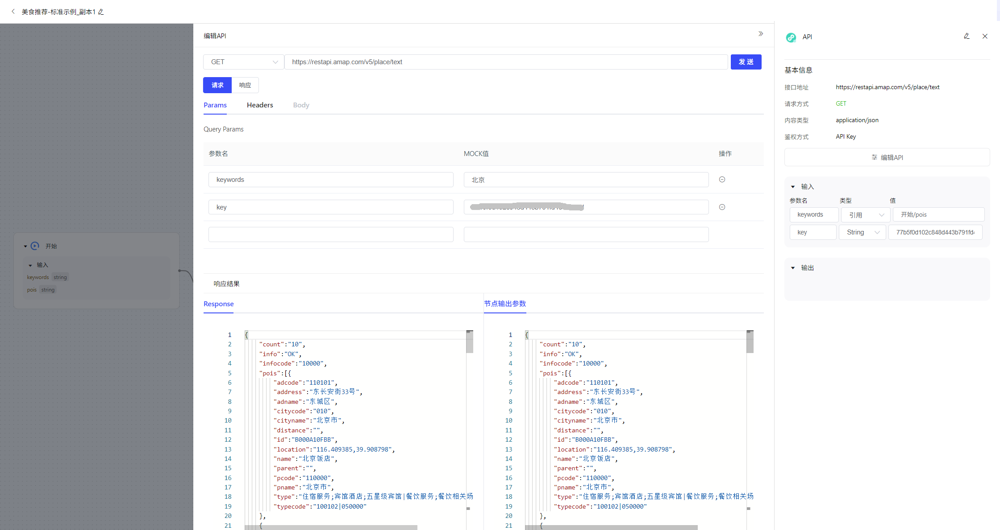
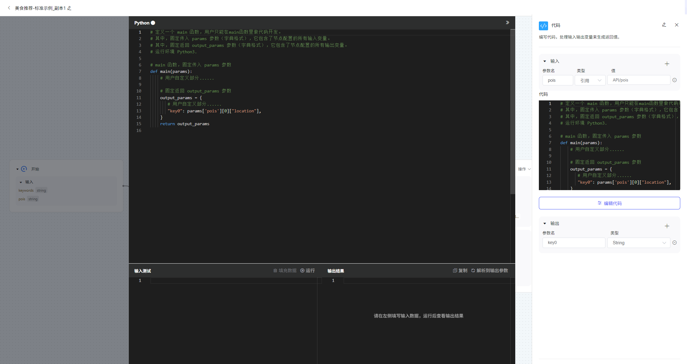
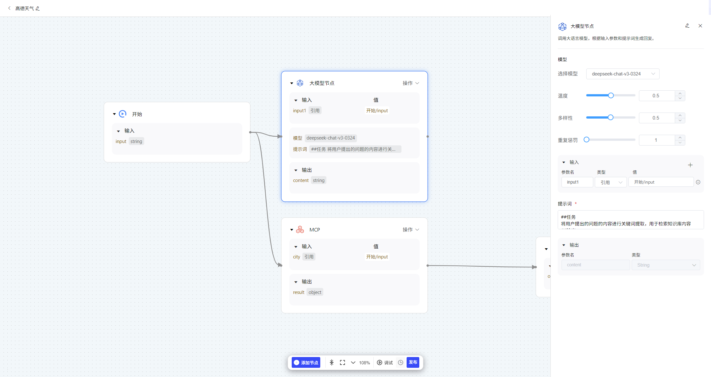
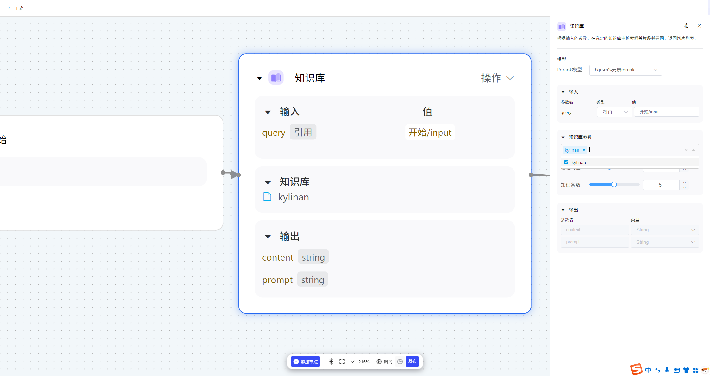
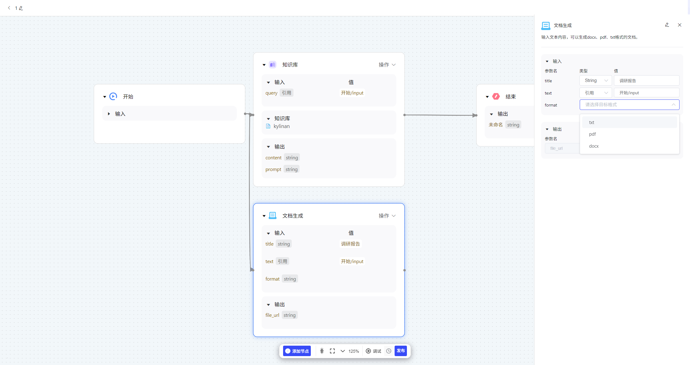
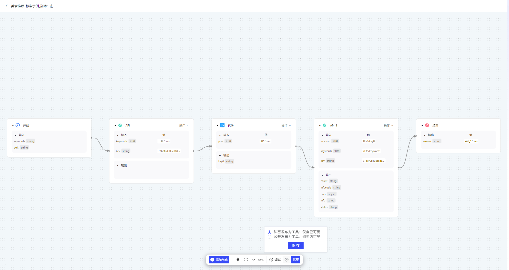

# 工作流

### **1、工作流创建**

点击“创建工作流”即可进入工作流创建界面。用户可自行设定工作流名称、工作流描述描述。平台内置了标准工作流示例，用户也可直接复制使用。

### **2、工作流编辑**

平台提供MCP、意图识别、API、代码、大模型、分支器、知识库、文档生成、文档解析节点。

#### **开始**

“开始” 节点不可以被复制或删除。定义所需的输入参数，会在插件被应用调用时，由思考模型根据参数描述从用户输入的原始内容中抽取并传入。

#### **MCP**

调用MCP server的能力。可添加已发布在MCP广场中的MCP server，并关联对应接口生成结果。

#### **意图识别**

识别用户的输入意图，并分配到不同分支执行。

#### **API**

支持接入遵守RESTful架构规范并采用标准认证机制的API。API接入前需要已经完成服务化，确保所有接入的API均遵循RESTful架构规范，确保使用无状态的请求模型并通过HTTP标准方法（如GET、POST)进行资源操作，同时接口使用标准的认证机制。此外，接口设计符合OpenAPI规范，接入的API已经过性能测试、安全审查和兼容性检测，以确保API的稳定性和可靠性。

**使用说明**：

I.添加API节点，可以手动逐步配置API基本信息。配置信息包括：请求参数和响应参数。您可不配置响应参数，直接根据API请求结果的返回信息自动解析输出参数，平台解析规则说明：当前支持接口返回内容类型有：JSON、XML、HTML、Plain Text、YAML、CSV。其中JSON、XML、YAML可被解析为JSON输出，便于您在后续节点引用某个参数或属性，其余类型支持以整个string类型输出。

ii.配置完成请求参数和响应参数后，点击【发送】，进行接口请求，下方将展示对应接口的原始API返回信息，和按照响应参数配置获得的参数返回信息，您可以检查返回信息是否符合预期。

iii.在完成API原始信息编辑后，您需要继续在右侧面板中对输入参数进行值配置，可以引用前序节点输出，或手动输入对应参数值。需要确保引用类型与设置类型一致。

API节点的http请求发送成功即为接口调试通过，在整体流程调试前，API节点需要为调试通过状态。

#### **代码**

在代码节点中，可通过编写代码实现自定义的处理功能。引入代码节点到画布中，可在编辑器（IDE）内看到默认的示例代码。

编辑器的使用：

引用输入：配置了输入参数名和参数值后，可以在编辑器中引用输入参数。编辑器引入输入参数时，需要通过字典变量 params 引入代码节点的输入参数。代码节点支持不设置输入参数，但是设置的输出参数需要配置对应的默认值或参数引用关系。

返回输出：需要在编辑器中定义一个字典变量，作为编辑器中函数的输出。代码节点的输出参数是该字典变量的键（key）。

运行时环境：编辑器支持的运行时环境为 Python 3 。 运行环境预制了NumPy、bs4包。当前运行环境暂不支持进行request请求或获取文件。

编辑器测试功能：

输入测试：在输入测试区域可以输入测试数据，并进行调试运行。“填充数据” 功能可以根据当前输入参数类型，生成输入数据。

#### **大模型**

大模型节点可调用大语言模型，根据输入参数和提示词生成回复。

#### **分支器**

分支器节点用于设计工作流内的分支流程，可以连接多个下游节点。当向该节点输入参数时，节点会从上到下依次判断是否符合条件，若设定条件成立则运行对应的条件分支，若均不成立则运行“否则”分支。可通过拖拽分支条件配置面板来设定分支条件的优先级。在每个分支条件中，支持选择判断关系（且/或），以及同时添加多个条件。

#### **知识库**

知识库节点支持根据输入的query，在选定的知识库中检索相关片段并召回，返回切片列表。你可以上传文件并建立知识库，在知识库节点中勾选想要使用的知识库进行检索。知识库节点需选择一个Rerank模型后，才能生效。

输入参数：参数名不可修改，参数类型为string，上级节点的输出参数会强制转换为string类型作为知识库节点的输入，输入参数有两种类型：1）引用类型为引用上一个节点的输出变量，2）常量类型，可以输入一个string类型的入参。

选择知识库：选择需要检索的知识库，支持选择多个知识库。

输出参数：在知识库中检索输出的变量信息及变量类型。

#### **文档生成**

输入文本内容，可以生成docx、pdf、txt格式的文档。

#### **文档解析节点**

输入txt、pdf、docx、xlsx、csv、pptx等格式文档的URL，可以解析提取出文档的文本内容。

#### 模版转换

使用 Jinja2 模版语法将数据转换为字符串的工具节点。它适合将前序步骤的多个变量，按需格式化并整合为单一文本，以便为后续步骤提供统一的数据输入。

#### **结束**

结束节点是组件的最终节点，输出组件运行后的最终结果。该结果将输出给调用此工具的应用或下游组件。可以配置输出参数：定义组件需要输出的参数。

### **3、工作流调试与发布**

编辑完毕的工作流，点击“调试”，运行成功后，即可进行发布。点击“发布”可进行发布方式选择，用户可进行私密发布，也可进行公开发布。发布完成的工作流可作为工具，被智能体调用。

私密发布：发布后仅对自己可见，可在“探索广场”-“私密发布的”查看。

公开发布：发布后可对全部用户进行共享，所有用户可在“探索广场”-“全部”查看。

已发布的工作流也可取消发布后，重新进行编辑。

